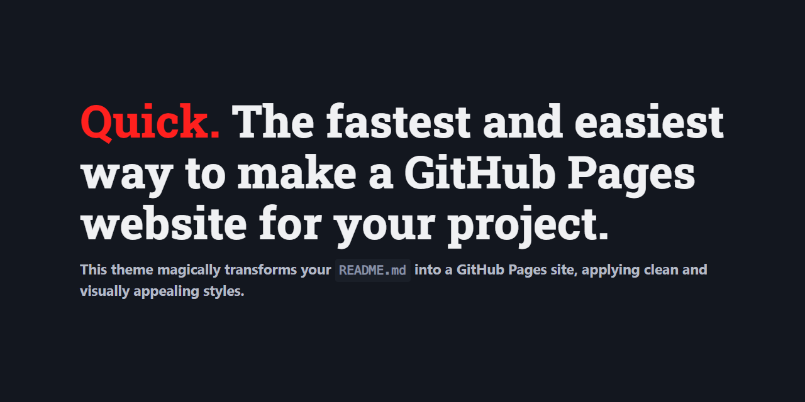

# <span style="color: #ff201e">Quick.</span> The fastest and easiest way to&nbsp;create a&nbsp;GitHub Pages website for your project.
#### The Quick theme magically transforms your `README.md` into a GitHub Pages site, applying clean and visually appealing styles.

<p class="ignore">Just see it yourself&thinsp;—&thinsp;<a href="https://devich.github.io/quick/">this page</a> is the same <code>README.md</code> file you’re reading, but with the Quick theme applied:</p>

<a class="ignore" href="https://devich.github.io/quick/"></a>

## Quick start

1. Make sure a `README.md` file exists in the root directory of your repo, and GitHub Pages is enabled in your repository settings.

2. Create a file named `_config.yml` in the root directory of your repository. The file should contain the following content:
```yaml
remote_theme: devich/quick@0.0.1
```

3. That’s it! There is no step 3. You now have a GitHub Pages website that’s based on your `README.md` file. The changes will take effect some time after you commit and push your updates to the repository. Enjoy your new website!


## Looking for a simple landing page for your project? 

No problem! You’re not restricted to using `readme.md` as the index page of your site. Simply create a file named `index.md`, and this theme will use it as the home page. Feel free to create as many pages as you want and link them within your site.

For instance, if you need a home page and an ‘About’ page, create files named `index.md` and `about.md`. Inside the `index.md` file, you can link to your ‘About’ page like this:

```md
[About this project](about)
```


## Fine tuning
### Additional settings in _config.yml

You can set additional parameters for the site in the `_config.yml` file.

The following options are available:

- `lang:` sets the language of the site. E.g. `en-US`, `uk`, `pl`, `fr-CA` and so on. The default value is `en-US`.
- `bg_color:` sets the background color of your website. Can be `dark`, `light` or `auto`. The default value is `auto`.
- `theme_color:` sets the main accent color for buttons, links, etc. It can be <nobr><code class="highlighter-rouge" style="color:#c52f21">red</code>,</nobr> <nobr><code class="highlighter-rouge" style="color:#d92662">pink</code>,</nobr> <nobr><code class="highlighter-rouge" style="color:#c0208a">fuchsia</code>,</nobr> <nobr><code class="highlighter-rouge" style="color:#9136a3">purple</code>,</nobr> <nobr><code class="highlighter-rouge" style="color:#7540be">violet</code>,</nobr> <nobr><code class="highlighter-rouge" style="color:#524ed1">indigo</code>,</nobr> <nobr><code class="highlighter-rouge" style="color:#2060de">blue</code>,</nobr> <nobr><code class="highlighter-rouge" style="color:#0172ac">azure</code>,</nobr> <nobr><code class="highlighter-rouge" style="color:#047878">cyan</code>,</nobr> <nobr><code class="highlighter-rouge" style="color:#007a50">jade</code>,</nobr> <nobr><code class="highlighter-rouge" style="color:#398712">green</code>,</nobr> <nobr><code class="highlighter-rouge" style="color:#a5d601">lime</code>,</nobr> <nobr><code class="highlighter-rouge" style="color:#f2df0d">yellow</code>,</nobr> <nobr><code class="highlighter-rouge" style="color:#ffbf00">amber</code>,</nobr> <nobr><code class="highlighter-rouge" style="color:#ff9500">pumpkin</code>,</nobr> <nobr><code class="highlighter-rouge" style="color:#d24317">orange</code>,</nobr> <nobr><code class="highlighter-rouge" style="color:#ccc6b4">sand</code>,</nobr> <nobr><code class="highlighter-rouge" style="color:#ababab">grey</code>,</nobr> <nobr><code class="highlighter-rouge" style="color:#646b79">zinc</code> or <nobr><code class="highlighter-rouge" style="color:#525f7a">slate</code>.</nobr> The default value is <nobr><code class="highlighter-rouge" style="color:#0172ac">azure</code>.
- `title:` sets the title of the site. If not set, your repository name will be used.
- `description`: sets the meta description tag, which typically contains a concise, relevant summary of the page’s content.
- `keywords`: sets keywords for the page, separated with commas.
- `gtag`: sets your Google Analytics tag if needed (e.g. G-A1BCDEFGHI).

Alternatively, you can copy the contents of the `_config.yml` file from the [theme repository](https://github.com/devich/quick/blob/main/_config.yml) into your own `_config.yml` file. This will give you access to all available options at once.


### Ignoring

If there’s a block in the `README.md` file that you don’t want to display on the GitHub Pages site, you can format this block as HTML and assign the `class="ignore"` attribute to it.

<p class="ignore">
    This paragraph <a href="https://devich.github.io/quick/">will not be displayed</a>
    on the site because it has an <code>"ignore"</code> class.
</p>

```html
<p class="ignore">
    This paragraph <a href="https://devich.github.io/quick/">will not be
    displayed</a> on the site because it has an <code>"ignore"</code> class.
</p>
```


### More customization

If you need to use your own CSS styles, create a file `assets/css/custom.css` in your repository and add your styles to it.

For a custom favicon, just place your file in `PNG` format at `assets/img/favicon.png`.

For full control, clone this repository and modify the template as you need.